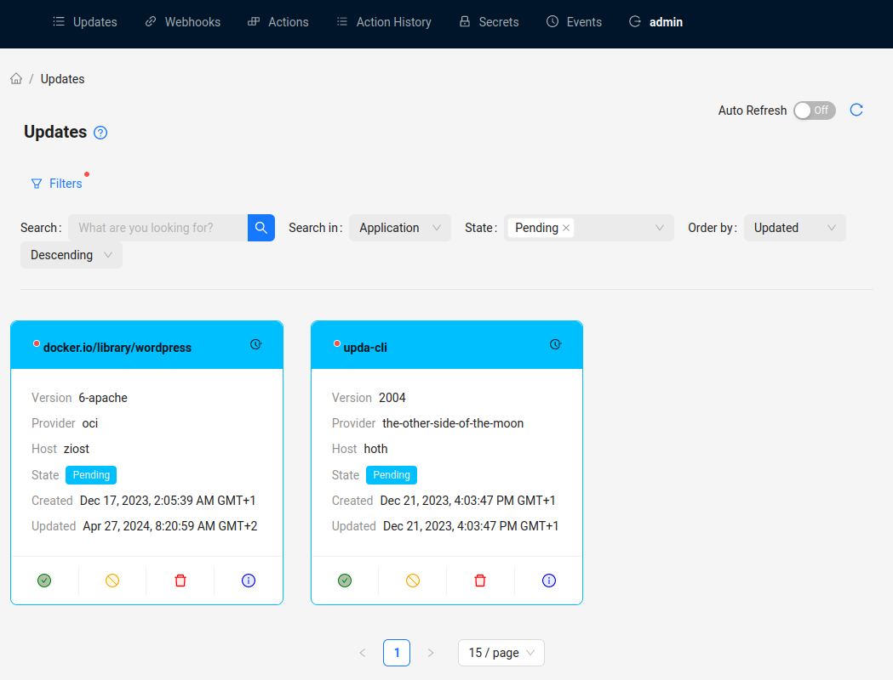
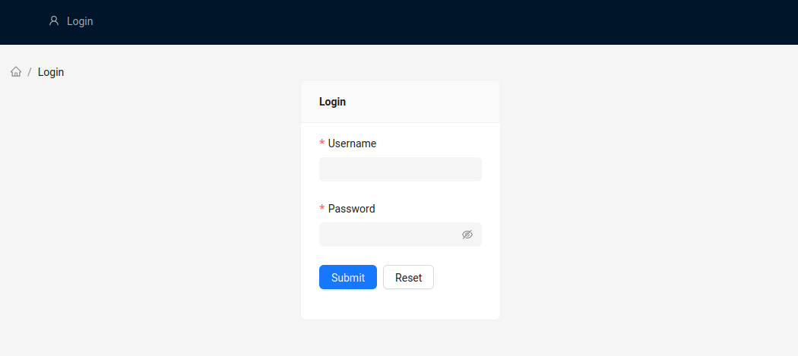
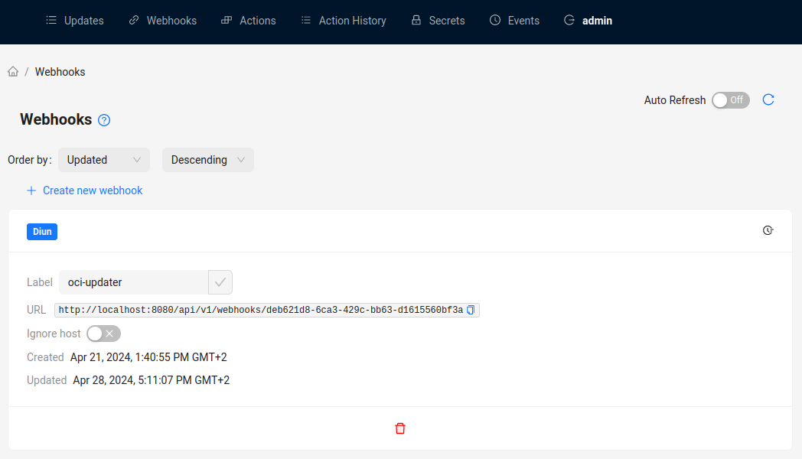
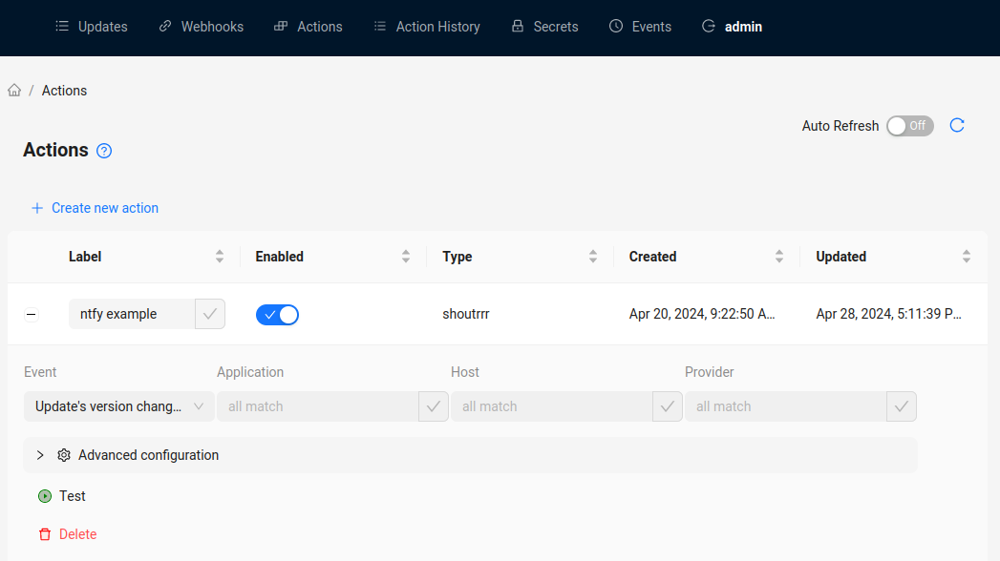
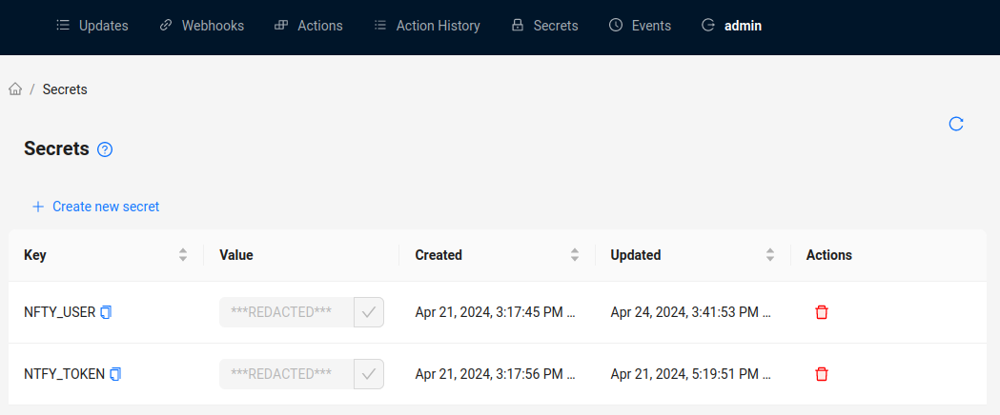
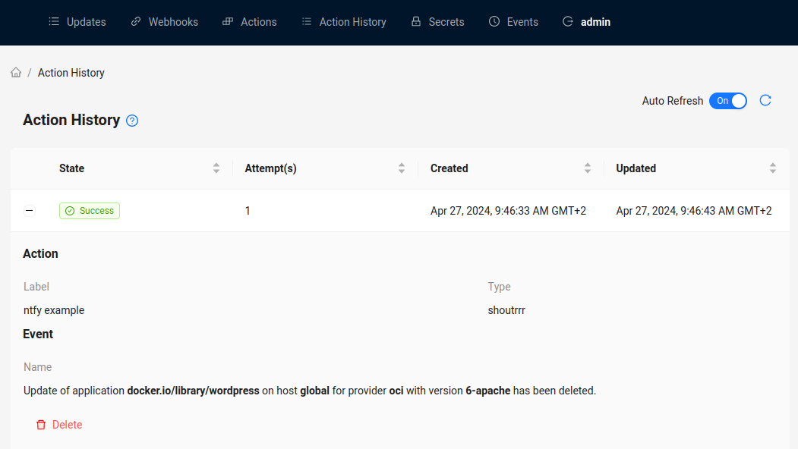
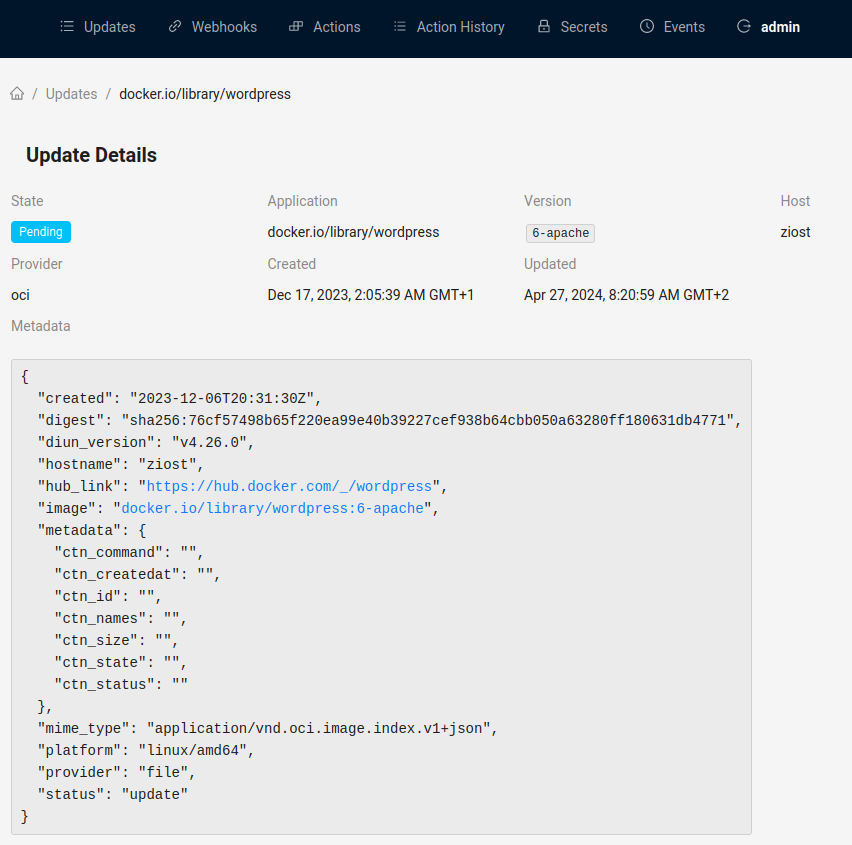
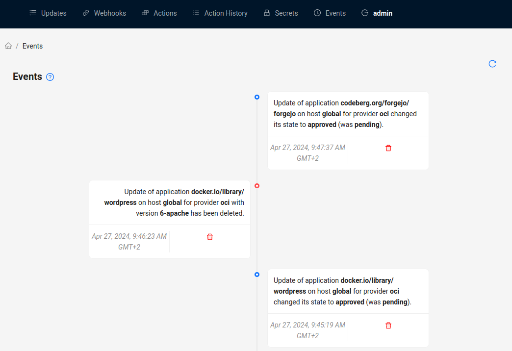

# Usage

Getting started in _upda_ is easy after it has been [deployed](./Deployment.md) successfully and is reachable through your
browser.



## Login

Head over to the deployed _upda_ instance in your browser and login with your credentials.



## Getting updates in via Webhooks

To get your first updates into _upda_, create a new Webhook. Webhooks are the central piece of how _upda_ gets notified
about updates.



After you've created a new Webhook, you should see

* a unique _upda_ `URL` which serves as entrypoint of other 3rd party applications,
  e.g., `/api/v1/webhooks/<a unique identifier>` and
* a corresponding `token` (write it down somewhere, you won't see it again after initial creation) for the URL which
  must be sent as `X-Webhook-Token` header when calling _upda_'s URL.

Next step is to make your 3rd party application use this webhook and bring in new updates into _upda_.

A good example is [duin](https://crazymax.dev/diun/), which is able to watch docker images for changes and updates. It
can be configured with a config file
and [diun's "notif" plugin supports calling external webhooks once a change is observed](https://crazymax.dev/diun/notif/webhook/).
We just need to configure _upda_ as the receiving application in diun's configuration file.

```yaml
notif:
  webhook:
    endpoint: https://upda.domain.tld/api/v1/webhooks/ee03cd9e-04d0-4c7f-9866-efe219c2501e
    method: POST
    headers:
      content-type: application/json
      X-Webhook-Token: <the token from webhook creation in upda>
    timeout: 10s
```

Expected payload is derived from the _type_ of the webhook which has been created in _upda_.

In addition, a webhook in _upda_ can be set to ignore the host. Please read more on that in the [Concepts](./Concepts.md)
section.

## Actions

Actions can be used to invoke arbitrary third party tools when an _event_ occurs, e.g., an update has been created or
modified. An action is triggered when its conditions are met, which means that the action's definition (event name,
host, application, provider) fits the change which happend in _upda_.

Actions have types. Different types require different payload to set them up. [shoutrrr](#shoutrrr) is supported as
action type, which can send notifications to a variety of services like Gotify, Ntfy, Teams, OpsGenie and many more.
It in turn also support invoking calls to an external URL. This means you can have a stream of events being triggered
when an update arrives in _upda_.

To create an Action, go to the Actions tab and click on _Create new action_. Enter the necessary information and
consult the Action's type documentation if necessary.



Supported events for Actions are the following:

| Event name               | Description                                                         |
|:-------------------------|:--------------------------------------------------------------------|
| `update_created`         | An update has been created                                          |
| `update_updated`         | An update has been updated (not necessarily its version attribute!) |
| `update_updated_state`   | An update's state changed                                           |
| `update_updated_version` | An update's version changed                                         |
| `update_deleted`         | An update has been removed                                          |

For privacy, an action's configuration supports upda's **secrets** vault, which means that before an action is
triggered, any occurrence of `<SECRET>SECRET_KEY</SECRET>` is properly replaced by the value of the `SECRET_KEY` defined
inside the vault.

Secrets can be used in all payload for an Action, including shoutrrr's URL. To create a new secret, go to the _Secrets_
tab and click on _Create new secret_.



In addition to secrets, upda provides **variables** which can be used with the `<VAR>VARIABLE_NAME</VAR>` syntax and any
occurrence is replaced before invocation as well.

| Variable name            | Description                                       |
|:-------------------------|:--------------------------------------------------|
| `<VAR>APPLICATION</VAR>` | The update's application name invoking the action |
| `<VAR>PROVIDER</VAR>`    | The update's provider name invoking the action    |
| `<VAR>HOST</VAR>`        | The update's host invoking the action             |
| `<VAR>VERSION</VAR>`     | The update's version (latest) invoking the action |
| `<VAR>STATE</VAR>`       | The update's state invoking the action            |

#### shoutrrr

[shoutrrr](https://github.com/containrrr/shoutrrr?tab=readme-ov-file#documentation) supports multiple services directly
which can be provided as simple URL, e.g., `gotify://gotify.example.com:443/<token>`, where `<token>`
can also be provided as secret: `gotify://gotify.example.com:443/<SECRET>GOTIFY_TOKEN</SECRET>`.

##### shoutrrr: example for sending mails

Before starting, add the following _Secrets_:

```
MAIL_USER
MAIL_PASS
MAIL_HOST
MAIL_PORT
MAIL_FROM
MAIL_TO
```

For each event, now create a new _Action_ with different payload:

_New updates_

| Field | Content                                                                                                                                                                                                     |
|:------|:------------------------------------------------------------------------------------------------------------------------------------------------------------------------------------------------------------|
| URL 1 | `smtp://<SECRET>MAIL_USER</SECRET>:<SECRET>MAIL_PASS</SECRET>@<SECRET>MAIL_HOST</SECRET>:<SECRET>MAIL_PORT</SECRET>/?from=<SECRET>MAIL_FROM</SECRET>&to=<SECRET>MAIL_TO</SECRET>&Subject=[upda]+New+Update` |
| Body  | `New update '<VAR>APPLICATION</VAR>' (<VAR>VERSION</VAR>) arrived on <VAR>HOST</VAR> for provider <VAR>PROVIDER</VAR>.`                                                                                     |

_Update changed_

| Field | Content                                                                                                                                                                                                         |
|:------|:----------------------------------------------------------------------------------------------------------------------------------------------------------------------------------------------------------------|
| URL 1 | `smtp://<SECRET>MAIL_USER</SECRET>:<SECRET>MAIL_PASS</SECRET>@<SECRET>MAIL_HOST</SECRET>:<SECRET>MAIL_PORT</SECRET>/?from=<SECRET>MAIL_FROM</SECRET>&to=<SECRET>MAIL_TO</SECRET>&Subject=[upda]+Update+changed` |
| Body  | `Update '<VAR>APPLICATION</VAR>' (<VAR>VERSION</VAR>) changed on <VAR>HOST</VAR> for provider <VAR>PROVIDER</VAR>.`                                                                                             |

_Version changed_

| Field | Content                                                                                                                                                                                                                 |
|:------|:------------------------------------------------------------------------------------------------------------------------------------------------------------------------------------------------------------------------|
| URL 1 | `smtp://<SECRET>MAIL_USER</SECRET>:<SECRET>MAIL_PASS</SECRET>@<SECRET>MAIL_HOST</SECRET>:<SECRET>MAIL_PORT</SECRET>/?from=<SECRET>MAIL_FROM</SECRET>&to=<SECRET>MAIL_TO</SECRET>&Subject=[upda]+Update+version+changed` |
| Body  | `Update's version changed to '<VAR>VERSION</VAR>' for '<VAR>APPLICATION</VAR>' on <VAR>HOST</VAR> and provider <VAR>PROVIDER</VAR>.`                                                                                    |

_State changed_

| Field | Content                                                                                                                                                                                                               |
|:------|:----------------------------------------------------------------------------------------------------------------------------------------------------------------------------------------------------------------------|
| URL 1 | `smtp://<SECRET>MAIL_USER</SECRET>:<SECRET>MAIL_PASS</SECRET>@<SECRET>MAIL_HOST</SECRET>:<SECRET>MAIL_PORT</SECRET>/?from=<SECRET>MAIL_FROM</SECRET>&to=<SECRET>MAIL_TO</SECRET>&Subject=[upda]+Update+state+changed` |
| Body  | `Update's state changed to '<VAR>STATE</VAR>' for '<VAR>APPLICATION</VAR>' (<VAR>VERSION</VAR>) on <VAR>HOST</VAR> and provider <VAR>PROVIDER</VAR>.`                                                                 |

In addition, you can have multiple URL fields, e.g., for sending a mail and a push notification.

### History of actions

Whenever new updates come in, are changed or an update's state changes, _upda_ enqueues all matching Actions.

If you head over to the Action History tab, you see pending, currently running, successful or error invocations of
actions.



## Manage updates

Once Update are in _upda_, you can filter them by state, application or other properties to only see pending Updates for
example.

Furthermore, you can change their state to be ignored (see [Concepts](./Concepts.md)) or delete them.


In addition, you can view an Update's details by clicking on the small info icon for an Update.



## See what has changed

For a full activity view, head over to the Events tab.


